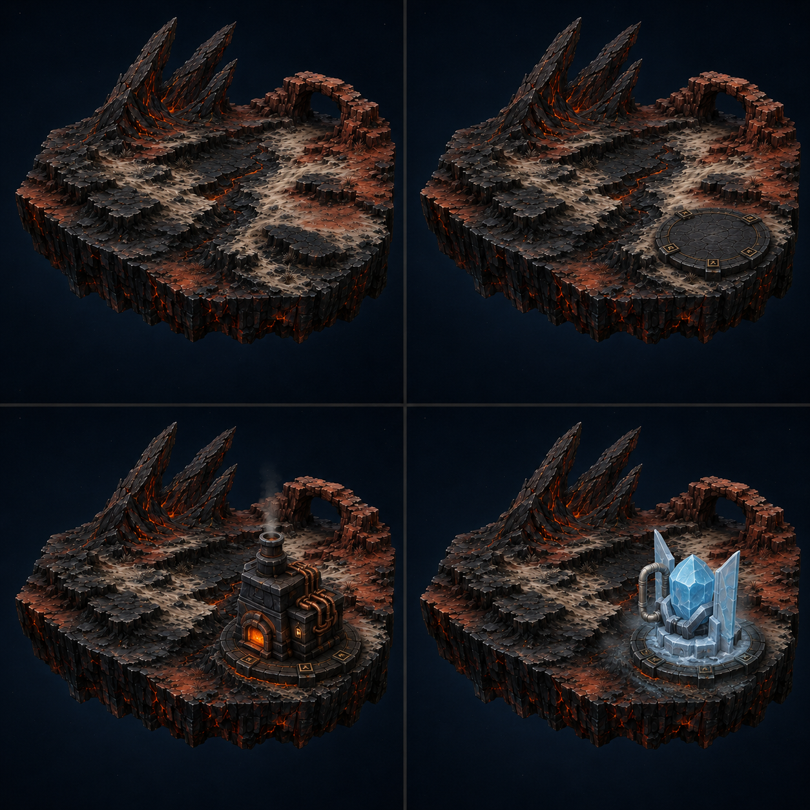
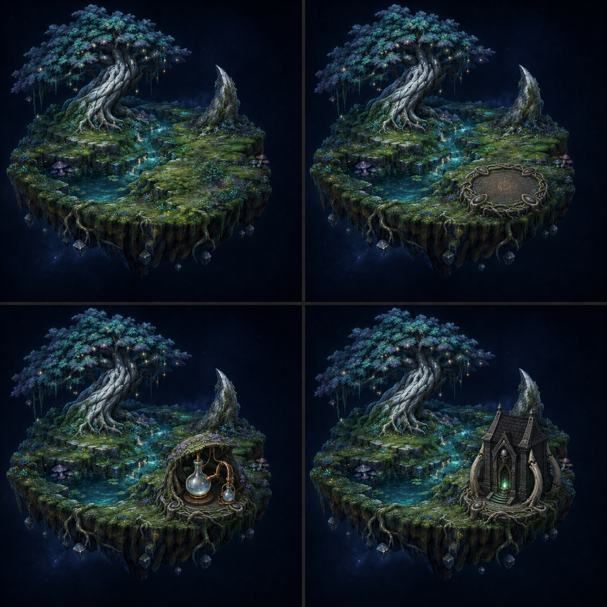
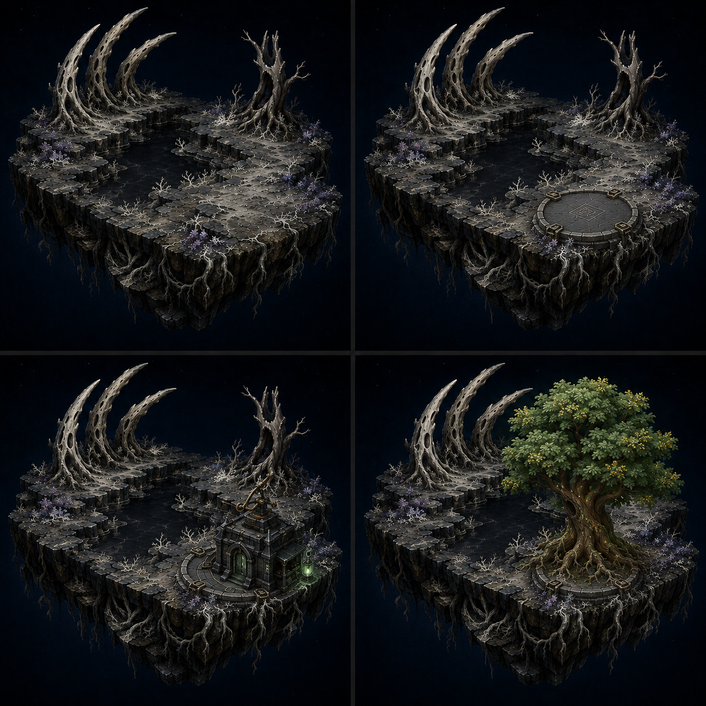
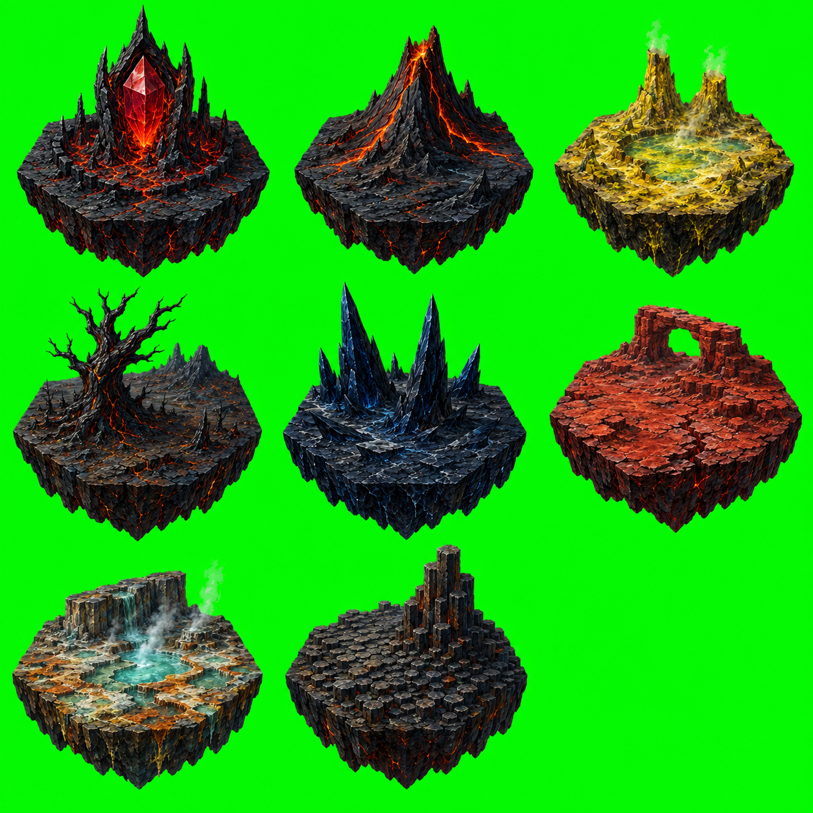
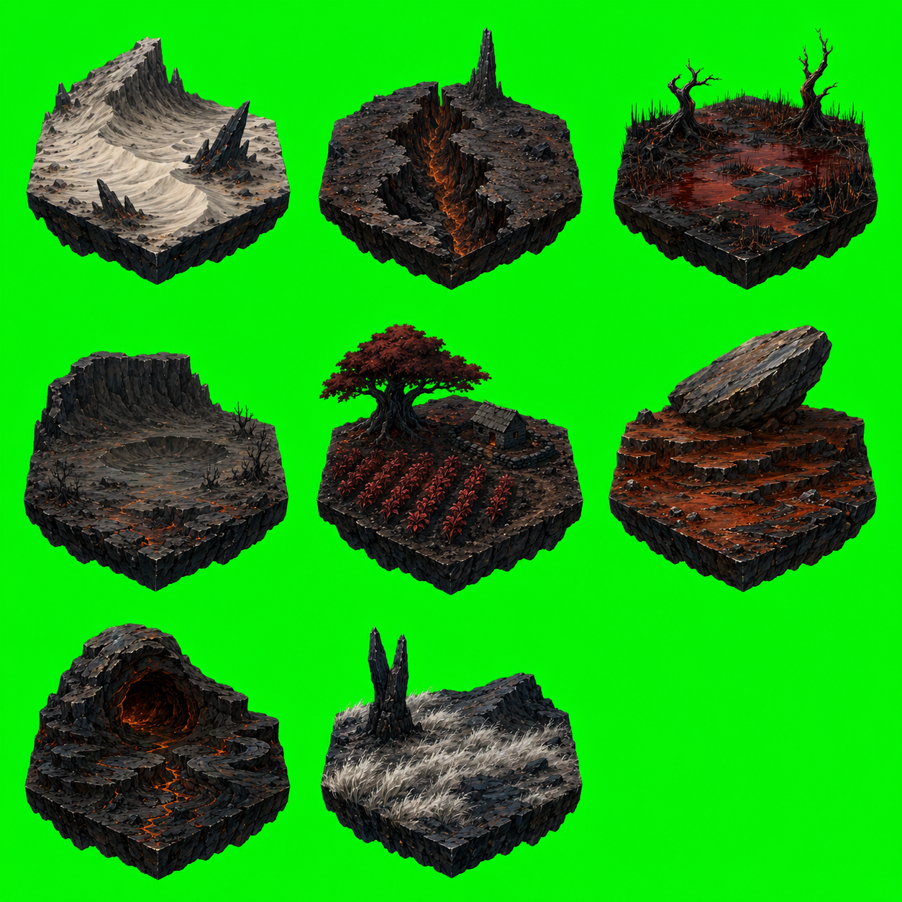

# Land and Attachment Visual Contract Concepts

- **Status:** Attachment boards are Approved Direction; biome sheets are Exploration Reference
- **Approved:** 2026-08-02
- **Related decisions:** [DD-0018](../../../Decisions/DD-0018-painted-astral-tabletop.md), [DD-0020](../../../Decisions/DD-0020-3d-land-and-attachment-visual-contract.md)
- **Production guide:** [Land and Attachment Visual Contract](../../Production_Guides/Land_and_Attachment_Visual_Contract.md)

## Approved attachment boards

### Fire--Earth

The native Geothermal Forge and off-color Frostglass Condenser demonstrate
that the attached card keeps its primary silhouette, material language, and
palette. The volcanic host affects only contact lighting, steam, wet stone,
ash, and the lowest edge treatment.

### Feywild Forest

The Moon-Dew Still belongs naturally to the host, while the Ossuary Archive
remains recognizably Death-aligned. Moss, roots, and reflected teal integrate
the Archive without converting it into a Fey structure.

### Death and Undeath

The Verdant Oak remains vigorously alive and green in the realm of Death. Ash,
pale lichen, and a cold contact rim affect only its lowest roots. This is the
clearest reference for preserving off-color attachment identity.

## Exploration references

The sheets explore silhouette and topographic variety for Fire-adjacent Lands.
They are not a required asset count, geometry specification, or promise of
one-to-one production fidelity. Their reusable ideas include volcanic spires,
sulfur basins, ash trees, obsidian ridges, mineral springs, basalt columns,
ash dunes, ravines, ember fens, calderas, cinder agriculture, ironstone slabs,
lava tubes, and silver-grass reclamation.

## Production interpretation

These images establish visual hierarchy and combination rules. They do not
authorize every crack, plant, vessel, root, highlight, or ornament as unique 3D
geometry. Production should preserve the large heightmap gestures, primary
silhouettes, material zones, and attachment ownership while simplifying
secondary detail into textures, clustered cards, decals, shader response, and
reused modular pieces.

The approved boards intentionally move toward simpler forms, but they remain
concept art. Final assets must pass the gameplay-camera and visual-budget tests
in the production guide.

## Rights and use

These are project concept images created with OpenAI image generation. They
should remain internal visual-direction references. Production assets require
review through the project's eventual asset, release, and attribution process.
