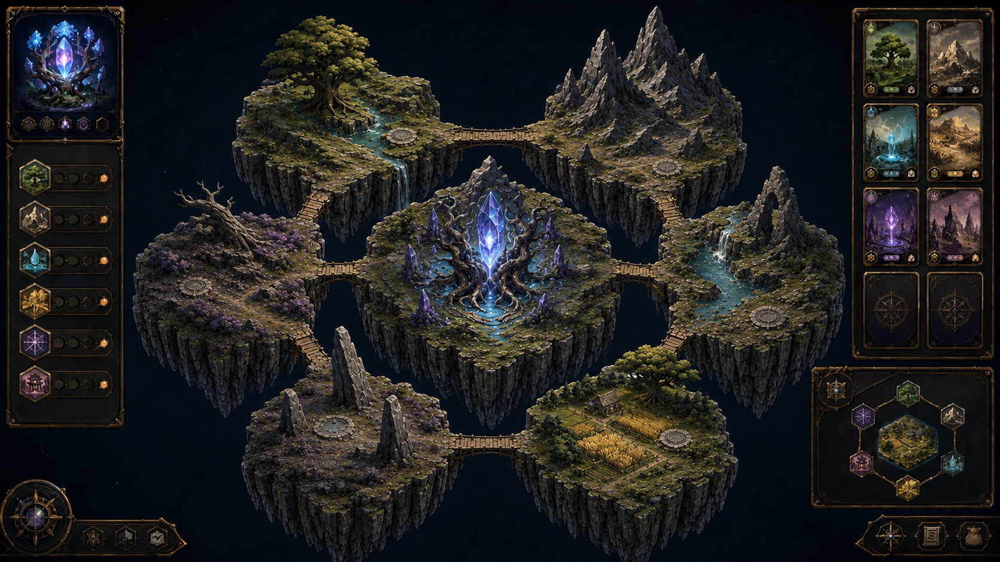

# Visual Identity and Main Stage

- **Status:** Foundational art direction; first Main Stage direction approved
- **Related decision:** [DD-0018](../Decisions/DD-0018-painted-astral-tabletop.md)
- **Related documents:** [PlaneGuardian GDD](../GDD/PlaneGuardian_GDD.md), [Card Zones and Attachments](../GDD/Card_Zones_and_Attachments.md), [First Plane Onboarding](../GDD/First_Plane_Onboarding.md)

## Visual north star

> A painted astral tabletop: stylized high-fantasy islands rendered like
> hand-painted magical miniatures suspended over a living cosmic Void.

The cards do not merely represent the Plane. Their identities visibly become
terrain, landmarks, bridges, creatures, atmosphere, and rules.

The direction favors strong silhouettes, exaggerated proportions, broad
painterly value shapes, controlled palettes, modular assets, and deterministic
composition over semi-realism and fine geometric detail.

## Approved Main Stage direction



The [concept record](Concepts/Main_Stage/README.md) establishes the first
approved visual target for the Main Stage. It is a composition, hierarchy, and
visual-language reference rather than a literal production screenshot.

The concept confirms that ordinary Lands are topography-first wilderness
dioramas. Buildings and other signs of development normally come from attached
cards or an explicitly civilized biome. The Void remains quiet negative space,
and island boundaries remain crisp beneath any optional atmospheric blending.

## Art-production principles

- Readability from the gameplay camera takes priority over close-up realism.
- One defining landmark is better than many small indistinct props.
- Geometry supplies form; painted textures and controlled lighting supply the
  illustration.
- Procedural generation composes authored visual vocabulary rather than
  scattering unrestricted random assets.
- Affinity changes shape, material, motion, and atmosphere, not only hue.
- Each important Plane metric receives a distinct visual channel.
- Ordinary card and island art must be reproducible and pinned to a generator
  version.

## Main Stage

The Main Stage is the primary view of the current Plane. The intended
construction layout presents the collection on the right, the Planar Seed and
ordered Land list on the left, attachment slots beside selected Lands, and a
small ring preview with neighbor details on hover or selection.

When editing recedes, the Plane should feel like a magical display table rather
than a conventional management dashboard.

The scene must read at three scales:

| Scale | Primary information |
| --- | --- |
| Whole Plane | Active extent, dominant identity, Stability, power, prosperity |
| Island | Biome, state, Enhancements, production character, adjacency |
| Card inspection | Exact rules, tags, rarity, Quality, history, provenance |

## The Void

The Void is a dark contemplative stage inspired by deep-field astronomy rather
than a flat black background or direct reuse of one real photograph. It uses:

- original procedural dust clouds;
- many small, mostly dim points of light;
- restrained deep color;
- several very slow parallax layers;
- occasional distant impossible silhouettes;
- subtle palette and motion inherited from the current Seed.

Motion remains slow enough to avoid fatigue and preserve the tabletop feeling.
The Void makes each fragment of habitable reality feel precious.

## Floating Land islands

Only Lands create ordinary floating hex islands. Each island uses a recognizable
hex footprint softened by procedural cliffs, roots, ice, cloud, ruins, water,
or magical boundaries. A narrow gap preserves the topology.

A Land visual can be assembled from:

```text
base island
+ biome surface
+ cliff profile
+ underside family
+ signature landmark
+ prop composition
+ affinity treatment
+ Manifestation treatment
+ current state
```

The system should reuse a controlled kit of island bodies, cliff profiles,
biome materials, undersides, bridges, props, landmarks, and effects. Variation
comes from shape parameters, composition, orientation, density, palette, and
semantic treatment.

Each island top is treated as a generated heightmap with a small number of
large elevation gestures. Most Lands are wild and use two or three
biome-identifying silhouette landmarks. At least one may sit near the rear edge
and break the local horizon so flatter Lands remain recognizable at gameplay
scale. A forest might use one ancient tree and a wooded ridge; a mountain uses
exaggerated peaks; a water Land uses a carved bluff, arch, or waterfall shelf.

Props form deliberate clusters and sight lines but remain subordinate to
topography. A settlement uses a small number of oversized recognizable
buildings, while an ordinary wild Land should not imply unearned development.
Cliff edges and undersides use clean, readable silhouettes against the Void.
Mist, smoke, dust, and glow are optional state or atmosphere layers and must
not be required to hide weak island geometry.

## Bridges and adjacency

Bridges make adjacency and support visible. Their material may become stone,
roots, chain, light, spectral architecture, water, ice, or wind-carried steps
according to card identity.

Stability changes bridge shape and motion more than color:

| State | Bridge presentation |
| --- | --- |
| Harmonious | Complete, supported, gently illuminated |
| Neutral | Quiet physical or magical connection |
| Strained | Warped, cracked, uneven, swaying, or sparking |
| Severely opposed | Incomplete sections held by unstable force |
| Dormant endpoint | Present but unlit, faded, or partly withdrawn |

Directional support can influence visual weight toward or away from the Seed.

## Painterly rendering

The intended rendering character uses:

- hand-painted or procedurally blended diffuse color;
- broad baked or analytical lighting gradients;
- subtle canvas or brush-grain treatment;
- painted normal information rather than scanned photoreal surfaces;
- limited specular response;
- controlled bloom and affinity rim light;
- ambient occlusion around landmarks and terrain contacts;
- soft haze and compressed value ranges;
- limited dynamic lights.

Materials should feel illustrated. Metal may use deliberately painted
highlights; vegetation uses clustered shapes rather than individual leaves;
stone uses selected facets and cracks rather than photographic noise.

## Affinity and semantic morphology

Elemental Affinity influences form and motion:

- **Earth:** terraces, broad anchors, weight, mineral strata;
- **Aether:** suspended rings, gaps, translucent or impossible geometry;
- **Fire:** rising spires, vents, internal glow, ash;
- **Ice:** radial crystal, sharp symmetry, frost suspension;
- **Air:** sails, vanes, lifted fragments, cloud and upward motion;
- **Water:** curved shells, channels, hanging falls, rounded forms;
- **Radiance:** halos, ordered rays, gilded edges, clarity;
- **Shadow:** missing surfaces, internal voids, deep occlusion.

Compounds combine motifs instead of simply mixing colors. Fire and Water may
produce steam, wet black stone, hot springs, and warm light beneath cool mist.

Other wheels provide further direction. Order favors repeated symmetry; Chaos
favors irregular orbit and asymmetry. Rooted Manifestation creates anchors;
Wandering creates sails and directed fragments. Artifice assembles geometry;
Wilding grows organic forms; Mundane identity expresses monumental accumulated
craft.

## Enhancements as landmarks

Enhancement cards appear as readable miniature landmarks without concealing
the host biome:

- Facility: workshop, foundry, mill, observatory;
- Fortification: wall, tower, gate, ward;
- Enchantment: aura, sigil, weather field, hovering geometry;
- Shrine: altar, idol, ritual circle, sacred tree;
- Lair: nest, cave, burrow, remains;
- Settlement: a small building cluster with one defining structure.

Nested attachments become secondary details around the primary landmark or
appear in expandable inspection rather than requiring another full-size object.

Empty attachment slots appear in the island itself as small flat clearings,
foundations, pedestals, or mounting plinths. Their material and shape may follow
the biome, but a shared rim glyph or structural motif keeps the game function
recognizable. A slot reads as unoccupied capacity, not as a prebuilt structure.

## Plane-state channels

Plane metrics must not all produce more brightness and clutter.

| Property | Primary visual expression |
| --- | --- |
| Size | Spatial extent, ring count, camera scale, bridge network |
| Power | Rift intensity, energetic arcs, orbitals, assertive motion |
| Stability | Alignment, cohesion, bridge form, synchronized movement |
| Prosperity | Activity, lights, cultivation, traffic, maintenance, decoration |
| Affinity | Palette, material, motifs, particles, UI ornament |
| Maturity | Seed structure and permanent silhouette stage |

A Plane may therefore look large but poor, small but powerful, prosperous but
unstable, or ancient but dormant.

### Stability

Stable islands and Seed parts move in synchronized rhythms. Strained Planes
show slight displacement, twisted bridges, lagging orbitals, cracks, fragments,
and turbulent dust. These effects should be smoothed and bounded rather than
making the interface physically difficult to use.

### Prosperity

Prosperity appears as inhabited activity: lights, cultivated patches, smoke,
maintained bridges, banners, moving carts or points of light, fuller vegetation,
and ornament. A poor Plane remains austere rather than automatically ugly.

### Power

Power appears through Rift depth, energy transmission, orbital activity,
projection across inner rings, and confident animation. High power combined
with low Stability should look forceful and dangerous rather than simply
bright.

## Modular Seed maturity

The Seed visual is built from roles:

```text
core
+ Rift aperture
+ foundation
+ crown or spires
+ roots or anchors
+ halo
+ orbitals
+ affinity ornaments
+ transient state effects
```

The original core, Rift shape, dominant motif, and primary affinities remain
recognizable through growth. Maturity reveals latent form rather than replacing
the Seed with an unrelated object.

### Permanent maturity

Provisional stages are:

1. **Nascent:** core, small Rift, minimal foundation and affinity treatment;
2. **Awakened:** first crown or anchor, enlarged Rift frame, first halo;
3. **Ascendant:** added spires, orbitals, layered structure, stronger motion;
4. **Sovereign:** completed silhouette, layered halo, mature Rift architecture,
   and one exceptional signature feature.

Permanent maturity changes structure and normally does not regress. Each stage
must be recognizable when rendered as a solid black silhouette.

### Transient condition

Current power, Stability, prosperity, activity, and damage alter reversible
lighting, particles, animation, cohesion, and visible habitation. A Sovereign
Seed may look weakened without reverting to a Nascent structure.

Thresholds use smoothing and hysteresis so lamps, particles, and geometry do
not flicker as numeric values cross small boundaries. Major maturity changes
receive deliberate transition ceremonies.

## Card-frame system

Card information uses separate channels:

| Property | Channel |
| --- | --- |
| Family | Frame silhouette and icon placement |
| Rarity | Ornament density, scarcity mark, pips or crown |
| Quality | Material, finish, wear, precision |
| Affinity | Edge color, shape pattern, and glyphs |
| Complexity | Rules-panel structure and secondary detail |
| Cooldown | External temporal seal or overlay |
| Unique status | Nameplate and provenance treatment |

A Common Masterwork card may have simple geometry with exquisite finish; a
Unique Ordinary card may have unmistakable identity ornament with plain
craftsmanship. Color always receives glyph or shape reinforcement for
accessibility.

## Procedural card art

Ordinary art is composed from deterministic layers:

1. matte-painted background;
2. generated horizon and composition;
3. subject silhouette;
4. modular morphological details;
5. affinity lighting and surface treatment;
6. atmosphere and symbolic secondary elements;
7. foreground particles or framing;
8. final painterly treatment.

Creature archetypes may include humanoid, quadruped, avian, serpentine,
insectoid, amorphous, construct, and spirit forms with modular heads, limbs,
wings, tails, armor, equipment, stance, and effects.

Card portraits and island scenes should reuse biome assets, landmarks,
creatures, effects, palettes, and lighting rigs. Generated output is cached by
card identity and visual-generator version. Approved community art for unique
cards is a versioned override with deterministic fallback.

## Camera and interface

The initial camera uses a three-quarter top-down view with restrained
perspective, smooth zoom across Plane, ring, and island scales, and likely
rotation in 60-degree increments. Constrained composition reduces the number
of angles from which every asset must appear perfect.

The UI uses stable dark translucent panels, card-shaped containers, clear
typography, restrained metallic or arcane edging, and affinity glyphs. Plane
identity may change accents, corner motifs, hover effects, and background
texture but never essential contrast, warning colors, disabled states,
cooldown readability, or navigation.

## Performance direction

The style favors reusable island geometry, texture atlases, instanced props,
limited dynamic lights, cached procedural assemblies, and aggressive LOD and
culling. Atmosphere and focal effects receive more rendering budget than raw
polygon count.

## First concept targets

1. Main Stage with the Seed and first ring over the Void.
2. One card shown across contrasting Rarity and Quality combinations.
3. First summoning from empty Void into a Nascent Seed.
4. One Seed identity shown at all four maturity stages.

The Main Stage concept must test whether UI, floating islands, bridges, cards,
and the Void remain legible together.

## Open questions

- Final camera freedom, field of view, and zoom bands.
- Initial biome, bridge, prop, and Seed component kit sizes.
- Exact Seed maturity requirements and whether names remain player-facing.
- Rendering treatment required to achieve brush character without obscuring UI.
- Low-spec reductions for particles, Void layers, and island state effects.
- Card portrait resolution, cache policy, and art-version migration.
- Audio identity corresponding to Plane state and affinity.
